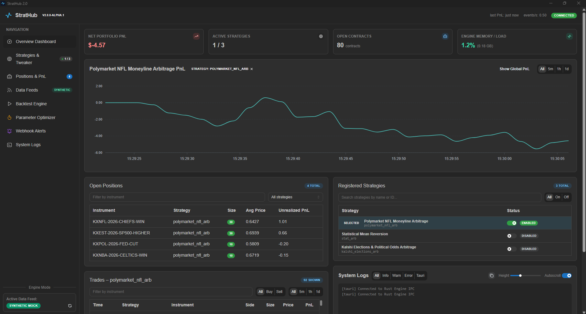
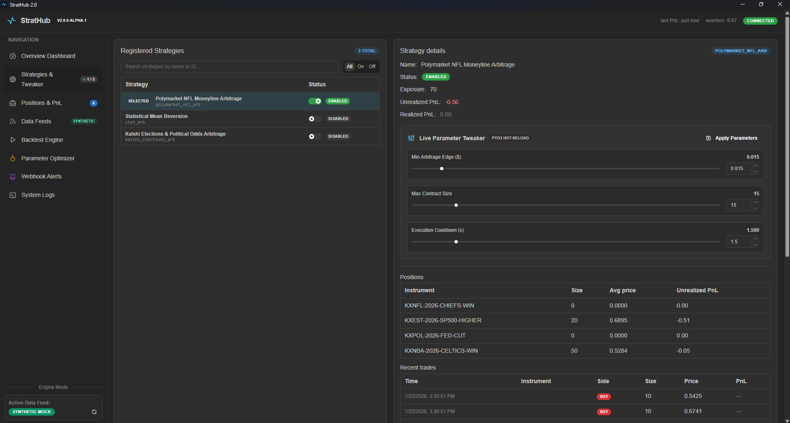
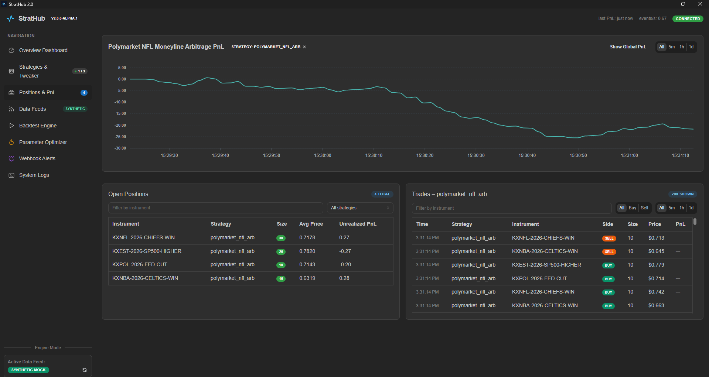
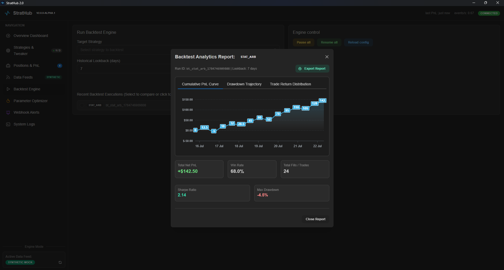
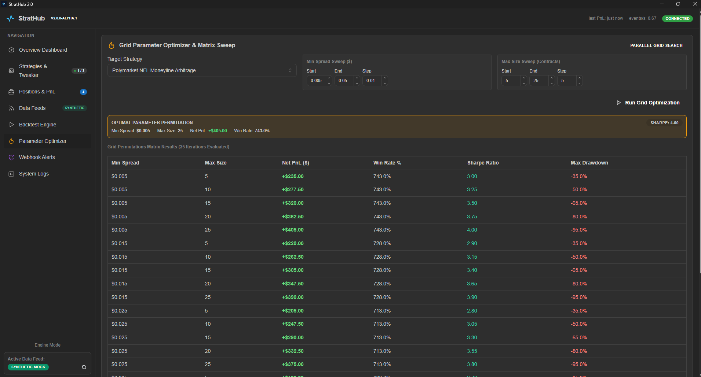
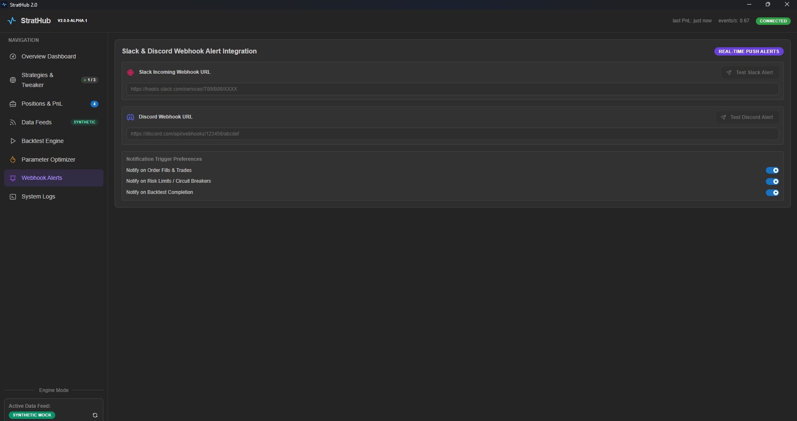
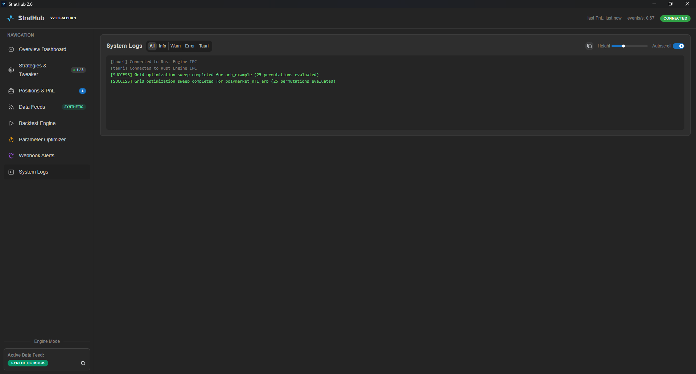

# StratHub 2.0 ⚡

> **Disclaimer**: This is a personal quantitative trading framework built for research, strategy backtesting, and paper trading prediction markets (Polymarket, Kalshi). It is provided as-is for learning and hobby experimentation.

StratHub 2.0 is a high-performance desktop application for developing, backtesting, and live-simulating quantitative prediction market strategies. Powered by a **Rust Core Engine**, **PyO3 Python Strategy Bridge**, and a sleek **Mantine React UI**.

---

## 📸 Interface Tour

### 1. Command Center Overview
The central dashboard gives a real-time view of net portfolio PnL, active strategies, open contracts, and live engine CPU/RAM load.



---

### 2. Strategies & Live Parameter Tweaker
Manage registered Python strategies and tweak parameters live using interactive sliders. Parameters hot-reload directly into the PyO3 Python runtime without pausing the engine loop.



---

### 3. Positions & Portfolio PnL
Track live mark-to-market positions, average entry prices, unrealized/realized PnL, and executed trade order streams.



---

### 4. Interactive Backtest Engine & PDF Tear-Sheet Exporter
Run historical backtests across custom lookback periods. Analyze multi-tab charts (Cumulative PnL, Drawdown Trajectory, Trade Distribution), compare runs side-by-side, and export printable HTML/PDF tear-sheets.



---

### 5. Grid Parameter Optimizer
Run parallel parameter sweeps across custom range bounds (`min_spread` vs `max_position_size`) to identify the optimal parameter permutation that maximizes Sharpe Ratio and Net PnL.



---

### 6. Slack & Discord Webhook Alerts
Configure real-time push notifications for order fills, risk circuit breakers, and backtest completion directly to your Slack or Discord channels.



---

### 7. System Logs & Live Diagnostics
Color-coded live system diagnostic log stream (`[INFO]` in white, `[CRITICAL]` in purple, `[SUCCESS]` in green, `[WARN]` in orange, `[ERROR]` in red) with log filtering, autoscroll, and 1-click clipboard copy.



---

## 🛠️ Architecture & Tech Stack

- **Backend Core**: Rust 2021 + PyO3 Python runtime bridge + Tokio async event stream.
- **Frontend UI**: React + TypeScript + Mantine UI + ApexCharts.
- **Storage**: High-density Gzip compressed binary format (`.bin.gz`) with 85%+ compression ratio.
- **Standalone CLI**: Pre-compiled `strathub-cli.exe` executable for viewing and inspecting backtests directly from the terminal without Cargo or Rust installed.

---

## 🚀 Quick Start

### 1. Run Desktop Application (Dev Mode)
```powershell
cd ui
npm install
npm run dev
```

### 2. Run Standalone CLI Tool
```powershell
# List saved compressed backtest runs
.\strathub-cli.exe list

# Inspect backtest details
.\strathub-cli.exe inspect bt_arb_example_1784746816393
```

---

## 📦 GitHub Actions CI & Multi-Platform Releases

Pushing a version tag automatically compiles and publishes desktop installers and standalone CLI binaries for **Windows (x86_64)** and **Linux (AMD64 x86_64)** to the GitHub Releases page:

```bash
git tag v2.0.0-alpha.1
git push origin v2.0.0-alpha.1
```

### Published Release Executables & Packages:
- 🪟 **Windows (x86_64)**: `strathub_app.exe`, `strathub-cli-windows-amd64.exe`, `.msi` installer
- 🐧 **Linux (AMD64 x86_64)**: `strathub_app-linux-amd64`, `strathub-cli-linux-amd64`, `.AppImage`, `.deb`

---

## 🐍 Writing Custom Python Strategies

Create a subclass of `BaseStrategy` under `strategies/`:

```python
from base_strategy import BaseStrategy

class MyPredictionStrategy(BaseStrategy):
    def __init__(self, params=None):
        super().__init__("my_strategy", params)

    def on_tick(self, snapshot: dict) -> dict:
        min_edge = float(self.get_param("min_spread", 0.015))
        ask = float(snapshot.get("best_ask", 0.0))
        ref_implied = snapshot.get("ref_implied_yes")

        if ref_implied and (ref_implied - ask) >= min_edge:
            return {
                "action": "BUY",
                "ticker": snapshot["ticker"],
                "size": 10,
                "price": ask,
                "reason": "Implied probability edge detected"
            }
        return None
```

Define parameter defaults in `strategies/<strategy_id>.params.json` to automatically generate UI sliders in the Live Parameter Tweaker!
